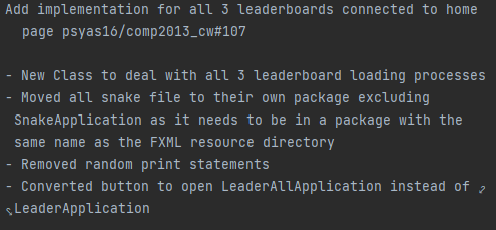
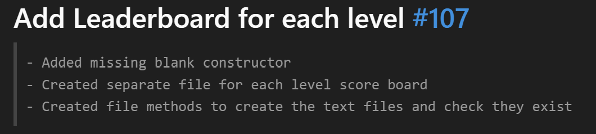
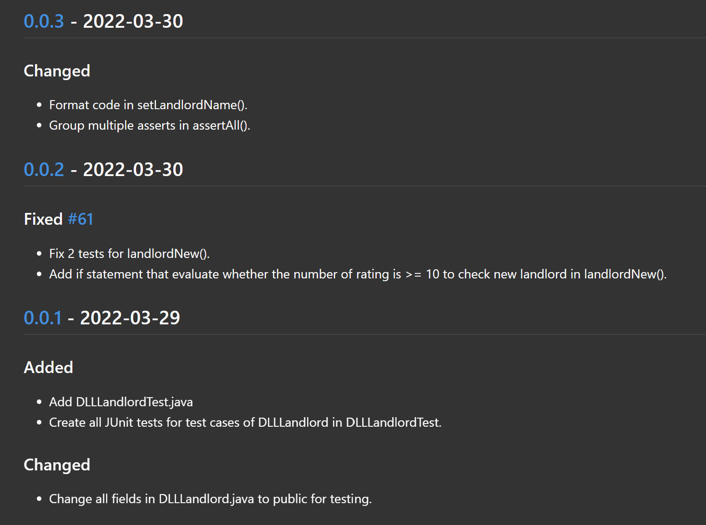

# Rules
## Gitlab
### Commits
#### Format
- Use "git commit -a" to get VSCode to open, so long text can be written
- Make sure the title is written in future tense
    - This commit will "Fix a bug in the foo class"
- Add bullet points to point out each fix or edit
- Link it to an issue if there is one
    - If this is missed, go to the commit and comment the issue link
- If the issue is small/doesn't have many details then a title and link will be fine

##### Example: 

### Changelog
- This will be updated everytime a large section of the code is completed
- Starting from the first sprint, it will be V0.0
    - The first numebr will be increased at the end of each sprint as there should be a functioning program by the end of each one
    - The second number is increased when a large section of code is added
        - This is not restricted to only 0-10 but can increase as much as needed, though keeping the amount low is advised

### Merge Requests
- Merge requests should have a simple title stating what branch is being merged into which
- A simple description should be included stating what has been accomplished
- The reviewer should be set to **Ashnip Sodhi** and the merge is only to be completed after the review is complete
    - In the case that **Ashnip Sodhi** is not free or the merge must be done immediately then the review approval may be bypassed, otherwise **Ashnip Sodhi** should be contacted

### Issues
- Issue titles should be formatted using one of following prefixes:
    - "Bug:"
    - "Addition:"
    - "Refactor:"
    - "Misc:"
- A short title of the issue should follow
- Then a short description describing the problem or the task at hand
- Make sure you give each issue a milestone and label
    - There **must** be at least one label on each issue
    - There doesn't have to be a milestone connected to each issue be would be highly advised

### Milestones and Labes
- Milestones and labels should be used whenever possible, so that it is easy to seperate issues
- Milestones should cover a broad aspect of the project or a process, so that issues can be made for it
- Creation of a milestone can be done by anyone, but it should be maintained and kept up to date, it should also be closed when necessary
    - Example: Milestone: "Home page", Issue: "Add buttons to home page"
- Labels should be no more than 2 words and must be used consistantly, those that are used extremely infrequently will be removed

## Coding Convention

Use Google's Python coding conventions:

https://google.github.io/styleguide/pyguide.html

## Project structure

- Each sprint a Milestone for should be created for the following:
    - Documentation
    - Front-end
    - Back-end

- At the end of each sprint, the following branches should be merged into the 
"official software" branch:
    - Documentation
    - Front-end
    - Back-end

- These will then be re-branched out to their own branches if necessary,
otherwise a "being worked on" branch will be created

- The changelog will be updated depending on all the changes of the previous sprint,
so it will be common for it to fall behind, in the final sprint, this will be brought back to the latest release before delivery