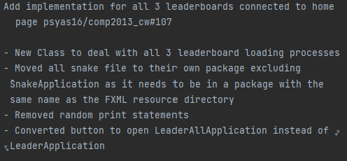

# Rules
## Gitlab
### Commits
#### Format
- Use "git commit -a" to get VSCode to open, so long text can be written
- Make sure the title is written in future tense
    - This commit will "Fix a bug in the foo class"
- Add bullet points to point out each fix or edit
- Link it to an issue if there is one
    - If this is missed, go to the commit and comment the issue link
- If the issue is small/doesn't have many details then a title and link will be fine

##### Example: 

### Changelog
- This will be updated everytime a large section of the code is completed
- Starting from the first sprint, it will be V0.0
    - The first numebr will be increased at the end of each sprint as there should be a functioning program by the end of each one
    - The second number is increased when a large section of code is added
        - This is not restricted to only 0-10 but can increase as much as needed, though keeping the amount low is advised

### Merge Requests
- Merge requests should have a simple title stating what branch is being merged into which
- A simple description should be included stating what has been accomplished
- The reviewer should be set to **Ashnip Sodhi** and the merge is only to be completed after the review is complete
    - In the case that **Ashnip Sodhi** is not free or the merge must be done immediately then the review approval may be bypassed, otherwise **Ashnip Sodhi** should be contacted

### Issues
- Issue titles should be formatted using one of following prefixes:
    - "Bug:"
    - "Addition:"
    - "Refactor:"
    - "Misc:"
- A short title of the issue should follow
- Then a short description describing the problem or the task at hand
- Make sure you give each issue a milestone and label
    - There **must** be at least one label on each issue
    - There doesn't have to be a milestone connected to each issue be would be highly advised

### Milestones and Labes
- Milestones and labels should be used whenever possible, so that it is easy to seperate issues
- Milestones should cover a broad aspect of the project or a process, so that issues can be made for it
- Creation of a milestone can be done by anyone, but it should be maintained and kept up to date, it should also be closed when necessary
    - Example: Milestone: "Home page", Issue: "Add buttons to home page"
- Labels should be no more than 2 words and must be used consistantly, those that are used extremely infrequently will be removed

## Coding Convention

### Class structure

### Brackets

### Comments
